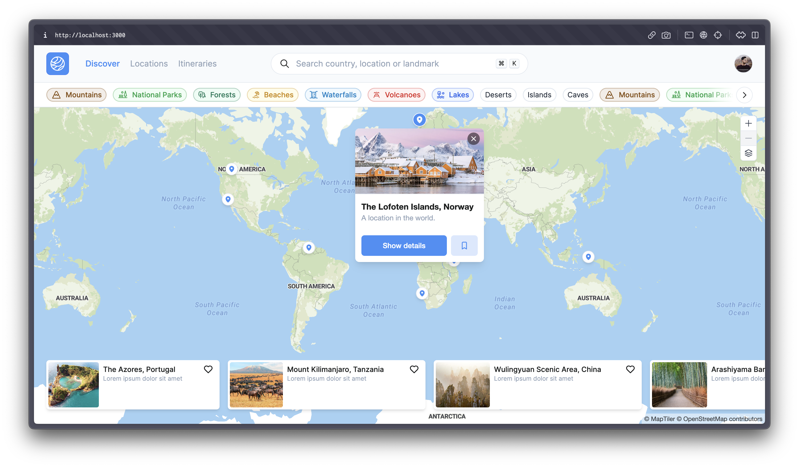
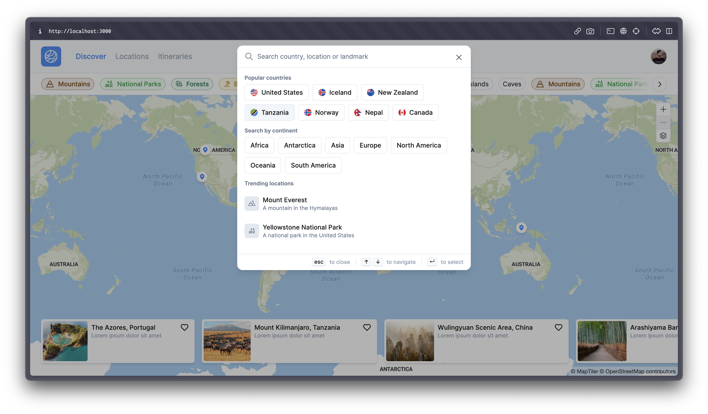

WIP project (very raw) that allow users to search and save relevant locations across the world, mostly focused on natural wonders and places of interest.

  
  

## How to run it

Given the work-in-progress status of the project, I'm not gonna release a production version of the app just yet. If you want to try it out, you'll have to clone the repo and run it locally. You can use this project as inspiration, or just to check out the code.

You can make it work by following these steps:

1. Replace the env variables with your on in your local `.env.local` file.
   _I'm using the free MapTiler API and Firebase, so you should create an account on both platforms and get your own API keys._
2. Run `npm i` in the root folder
3. Run `npm run dev` in the root folder
